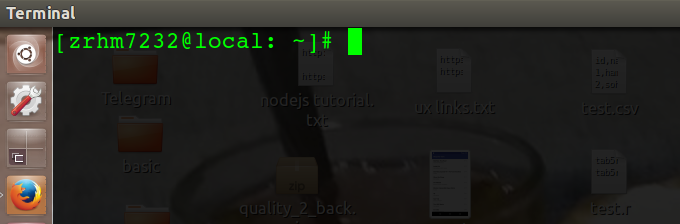

<p align="center">  </p>

# My Ubuntu terminal shorter
follow these steps:
- paste the python file inside home directory
- open your home directory .bashrc file (vim ~/.bashrc)
- add this line:

```
# new terminal path looks

 export PROMPT_COMMAND='PS1="$(python ~/.short.pwd.py)"' 
```

